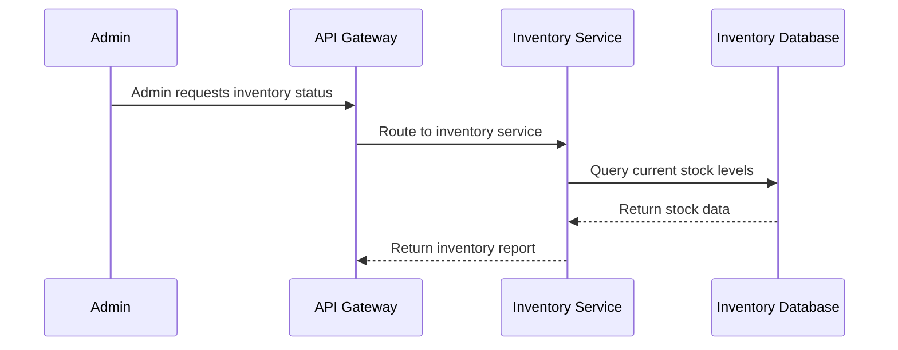

## Details

| Field               | Value                    |
|---------------------|--------------------------|
| **Unique ID**       | inventory-check-flow                   |
| **Name**            | Inventory Stock Check                 |
| **Description**     | Admin checks and updates inventory stock levels          |

## Sequence Diagram

## Controls
    _No controls defined._

## Metadata
  _No Metadata defined._
