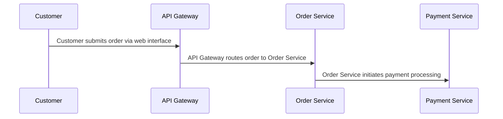

## Details

| Field               | Value                    |
|---------------------|--------------------------|
| **Unique ID**       | order-processing-flow                   |
| **Name**            | Customer Order Processing                 |
| **Description**     | End-to-end flow from customer placing an order to payment confirmation          |

## Sequence Diagram

## Controls
    _No controls defined._

## Metadata
  _No Metadata defined._
