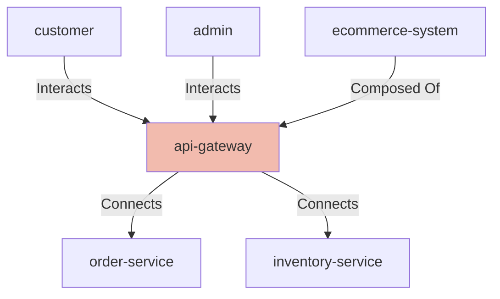

## Details

| Field               | Value                    |
|---------------------|--------------------------|
| **Unique ID**       | api-gateway                   |
| **Node Type**       | service             |
| **Name**            | API Gateway                 |
| **Description**     | Entry point for all client requests.          |

## Interfaces
        

            <table>
                <thead>
                <tr>
                    <th>Key</th>
                    <th>Value</th>
                </tr>
                </thead>
                <tbody>
                <tr>
                    <td>
                        <b>UniqueId</b>
                    </td>
                    <td>
                        gateway-https
                            </td>
                </tr>
                <tr>
                    <td>
                        <b>AdditionalProperties</b>
                    </td>
                    <td>
                        

                            <table>
                                <thead>
                                <tr>
                                    <th>Key</th>
                                    <th>Value</th>
                                </tr>
                                </thead>
                                <tbody>
                                <tr>
                                    <td>
                                        <b>Name</b>
                                    </td>
                                    <td>
                                        Public API Interface
                                            </td>
                                </tr>
                                <tr>
                                    <td>
                                        <b>Protocol</b>
                                    </td>
                                    <td>
                                        HTTPS
                                            </td>
                                </tr>
                                <tr>
                                    <td>
                                        <b>Host</b>
                                    </td>
                                    <td>
                                        api.shop.example.com
                                            </td>
                                </tr>
                                <tr>
                                    <td>
                                        <b>Port</b>
                                    </td>
                                    <td>
                                        443
                                            </td>
                                </tr>
                                <tr>
                                    <td>
                                        <b>Path</b>
                                    </td>
                                    <td>
                                        /
                                            </td>
                                </tr>
                                </tbody>
                            </table>
                        

                    </td>
                </tr>
                </tbody>
            </table>
        

        

            <table>
                <thead>
                <tr>
                    <th>Key</th>
                    <th>Value</th>
                </tr>
                </thead>
                <tbody>
                <tr>
                    <td>
                        <b>UniqueId</b>
                    </td>
                    <td>
                        order-client
                            </td>
                </tr>
                <tr>
                    <td>
                        <b>AdditionalProperties</b>
                    </td>
                    <td>
                        

                            <table>
                                <thead>
                                <tr>
                                    <th>Key</th>
                                    <th>Value</th>
                                </tr>
                                </thead>
                                <tbody>
                                <tr>
                                    <td>
                                        <b>Protocol</b>
                                    </td>
                                    <td>
                                        REST
                                            </td>
                                </tr>
                                <tr>
                                    <td>
                                        <b>Description</b>
                                    </td>
                                    <td>
                                        Outbound connection to Order Service
                                            </td>
                                </tr>
                                </tbody>
                            </table>
                        

                    </td>
                </tr>
                </tbody>
            </table>
        

        

            <table>
                <thead>
                <tr>
                    <th>Key</th>
                    <th>Value</th>
                </tr>
                </thead>
                <tbody>
                <tr>
                    <td>
                        <b>UniqueId</b>
                    </td>
                    <td>
                        inventory-client
                            </td>
                </tr>
                <tr>
                    <td>
                        <b>AdditionalProperties</b>
                    </td>
                    <td>
                        

                            <table>
                                <thead>
                                <tr>
                                    <th>Key</th>
                                    <th>Value</th>
                                </tr>
                                </thead>
                                <tbody>
                                <tr>
                                    <td>
                                        <b>Protocol</b>
                                    </td>
                                    <td>
                                        REST
                                            </td>
                                </tr>
                                <tr>
                                    <td>
                                        <b>Description</b>
                                    </td>
                                    <td>
                                        Outbound connection to Inventory Service
                                            </td>
                                </tr>
                                </tbody>
                            </table>
                        

                    </td>
                </tr>
                </tbody>
            </table>
        

        

            <table>
                <thead>
                <tr>
                    <th>Key</th>
                    <th>Value</th>
                </tr>
                </thead>
                <tbody>
                <tr>
                    <td>
                        <b>UniqueId</b>
                    </td>
                    <td>
                        gateway-health
                            </td>
                </tr>
                <tr>
                    <td>
                        <b>AdditionalProperties</b>
                    </td>
                    <td>
                        

                            <table>
                                <thead>
                                <tr>
                                    <th>Key</th>
                                    <th>Value</th>
                                </tr>
                                </thead>
                                <tbody>
                                <tr>
                                    <td>
                                        <b>Name</b>
                                    </td>
                                    <td>
                                        Health Check
                                            </td>
                                </tr>
                                <tr>
                                    <td>
                                        <b>Protocol</b>
                                    </td>
                                    <td>
                                        HTTP
                                            </td>
                                </tr>
                                <tr>
                                    <td>
                                        <b>Path</b>
                                    </td>
                                    <td>
                                        /health
                                            </td>
                                </tr>
                                </tbody>
                            </table>
                        

                    </td>
                </tr>
                </tbody>
            </table>
        

## Related Nodes

## Controls

        ### Performance

        API Gateway rate limiting and caching requirements

        

            <table>
                <thead>
                <tr>
                    <th>Requirement URL</th>
                    <th>Config</th>
                </tr>
                </thead>
                <tbody>
                    <tr>
                        <td>
                                <a href="https://internal-policy.example.com/performance/rate-limiting" target="_blank">
                                    https://internal-policy.example.com/performance/rate-limiting
                                </a>
                        </td>

                        <td>
                                <a href="https://configs.example.com/gateway/rate-limits.yaml" target="_blank">
                                    https://configs.example.com/gateway/rate-limits.yaml
                                </a>

                        </td>
                    </tr>
                    <tr>
                        <td>
                                <a href="https://internal-policy.example.com/performance/caching-policy" target="_blank">
                                    https://internal-policy.example.com/performance/caching-policy
                                </a>
                        </td>

                        <td>
                                <table>
                                    <thead>
                                    <tr>
                                        <th>Key</th>
                                        <th>Value</th>
                                    </tr>
                                    </thead>
                                    <tbody>
                                        <tr>
                                            <td>default-ttl-seconds</td>
                                            <td>300</td>
                                        </tr>
                                        <tr>
                                            <td>cache-control</td>
                                            <td>private</td>
                                        </tr>
                                    </tbody>
                                </table>

                        </td>
                    </tr>
                </tbody>
            </table>
        

## Metadata
  

      <table>
          <thead>
          <tr>
              <th>Key</th>
              <th>Value</th>
          </tr>
          </thead>
          <tbody>
          <tr>
              <td>
                  <b>Tech Owner</b>
              </td>
              <td>
                  Edge Team
                      </td>
          </tr>
          <tr>
              <td>
                  <b>Repository</b>
              </td>
              <td>
                  https://github.com/example/api-gateway
                      </td>
          </tr>
          <tr>
              <td>
                  <b>Deployment Type</b>
              </td>
              <td>
                  container
                      </td>
          </tr>
          <tr>
              <td>
                  <b>Business Criticality</b>
              </td>
              <td>
                  high
                      </td>
          </tr>
          </tbody>
      </table>
  

