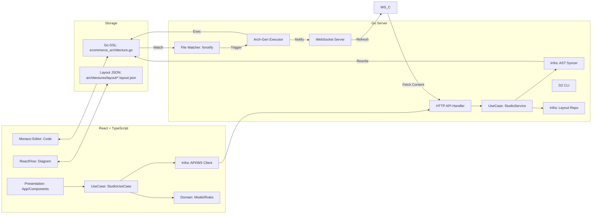
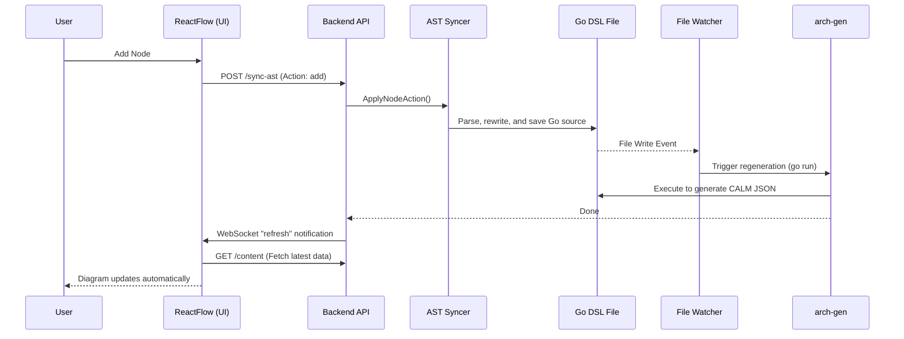

# CALM Studio Architecture Overview

CALM Studio is a bidirectional sync-based IDE/visualizer for intuitive architecture modeling using FINOS CALM (Common Architecture Language Model). It treats the Go DSL as the "Single Source of Truth," where UI operations are reflected in the Go code via AST synchronization. The frontend is built on three principles: "Separation of Business Rules," "Centralization of Side Effects," and "Thin UI."

## 1. System Diagram

The frontend (React/TS) and backend (Go) are tightly coupled to synchronize the Go DSL code with the diagrams on the UI.

---

## 2. Backend Architecture (Go)

The backend acts not just as a simple API server, but as an engine for analyzing, manipulating, and executing Go code.

### Key Components

- **Server (`cmd/studio/main.go`)**: An API/WS server using `gorilla/websocket` and the standard `http` package.
- **StudioService (`internal/usecase`)**: Orchestration of layout management and AST synchronization.
- **AST Syncer (`internal/infra/ast`)**: Directly rewrites the DSL files at the source level using `go/ast`, `go/parser`, and `go/format`. Node additions/deletions/updates in the UI are reflected in the Go code.
- **Layout Repository (`internal/infra/repository`)**: Saves layouts (relative coordinates + parentMap) in `architectures/layout/*.layout.json`.
- **Generator**: Executes `go run ./cmd/arch-gen` as a subprocess to generate CALM JSON/D2 from the DSL.
- **D2 CLI**: Converts D2 DSL to SVG (`d2 - -`).
- **File Watcher**: Monitors changes in `internal/`, etc., using `fsnotify` and automatically updates the diagram even upon manual updates.

### Main API Endpoints

- `GET /content`: Returns the current Go code, CALM JSON, D2 DSL, and SVG image.
- `POST /sync-ast`: Reflects UI operations (add/delete/update nodes) into the Go code.
- `GET/POST /layout`: Persists ReactFlow node position information.
- `POST /update`: Saves direct edits from the code editor to the file.

### Clean Arch Compliance and Exceptions (Go side)
**Conclusion**: While the primary separation of Domain/UseCase/Infra is achieved, some "exceptions" remain where logic is pushed into the Framework for implementation and operational convenience.

- **Compliant Points**
  - **Port Definitions in Domain**: `ASTSyncer` / `LayoutRepository` are defined in `internal/domain/ports.go`, isolating external details.
  - **Aggregated Procedures in UseCase**: `internal/usecase/studio.go` orchestrates layout saving and AST synchronization.
  - **Infra Implements Ports**: `internal/infra/ast` and `internal/infra/repository` handle concrete implementations.

- **Exceptions (Violations maintained for now)**
  - **I/O and Generation in Framework**: `cmd/studio/main.go` directly handles `go run` / `d2` execution and file I/O.
  - **DSL Updates in Framework**: `applyD2ChangesToGo` contains logic to update the Go DSL using regular expressions.

- **Reasons for Exceptions (Pragmatic Reasons)**
  - Studio is a development support tool, and the **execution environment is CLI-oriented** and changes rapidly.
  - Processes calling external programs like `go run` / `d2` have a **high frequency of adjustment and are easier to manage in one place**.
  - The UI/Sync features are still evolving, and **excessive decoupling might slow down the development speed**.

**Policy**: Maintain the separation level shown here in the future and avoid over-engineering the decoupling.  
The reason is to prioritize speed and operability for tool development, while keeping exceptions understood and minimized.

---

## 3. Frontend Architecture (TypeScript/React)

A modern SPA environment built with Vite + React + Tailwind CSS.

### Key Libraries

- **ReactFlow**: Diagram rendering and node manipulation.
- **Monaco Editor (`@monaco-editor/react`)**: A VS Code-like code editing experience.
- **Dagre**: Automatic layout calculation for diagrams.
- **Lucide React**: UI icons.

### Clean Arch Compliance and Exceptions (TypeScript side)
**Conclusion**: Instead of a "full multi-layered" approach, the structure is integrated into three principles that are highly practical for React. Boundaries are clear, but some parts are reasonably simplified for UI-centric needs.

- **Compliant Points (Integration of 3 Principles)**
  1. **Separation of Business Rules from UI**
     - **Implementation**: Calculation and comparison of CALM parent-child relationships are centralized in `src/domain/` (`buildParentMap`, `parentMapEquals`).
     - **Reason**: By extracting pure logic that does not depend on the UI lifecycle, it becomes easier to reuse, test, and modify.
  2. **Encapsulation of Side Effects**
     - **Implementation**: HTTP/WS are centralized in `src/infra/`, and call procedures are centralized in `src/usecase/`.
     - **Reason**: Eliminating external I/O from the UI allows changes to communication or synchronization procedures to be consolidated in one place.
  3. **Thin UI as an Adapter**
     - **Implementation**: `App.tsx` is limited to screen state, event wiring, and rendering, delegating data fetching and updates to the UseCase.
     - **Reason**: Since the UI is an area of frequent change, the impact of adding features or changing designs can be minimized.

- **Exceptions (Intentional Simplification)**
  - **Strict Port/Adapter Separation Not Adopted**: Prioritized development speed over strict DI/Port patterns in React.
  - **State Integration Remains in UI**: Keeping state aggregation in `App.tsx` is a decision aligned with React's state management characteristics.

**Policy**: Maintain the separation level of the "3 Principles" and avoid strict multi-layering in the future.  
The reason is to balance React development speed with operability, as further decomposition is judged to have higher costs than benefits.

### Synchronization Mechanism

1. **Initial Load**: Fetches all data from `/content` and converts CALM JSON to ReactFlow format via `transformToReactFlow`.
2. **Layout/Grouping**:
   - Layouts are saved as relative coordinates, and parent-child relationships are recorded in `parentMap`.
   - When the `composed-of` relationship changes, the entire layout is automatically recalculated using Auto Layout.
3. **Real-time Sync**:
   - When a file is changed on the backend, a `refresh` notification is sent via WebSocket, and the frontend refetches the data.
   - UI operations call `sync-ast` via the `usecase`, updating the Go files on the backend.
4. **Multi-Tab View**:
   - `Merged`: Split-view of code and diagram (IDE style).
   - `D2 Diagram`: Full-width display of the D2 SVG with zoom/pan capabilities.

---

## 4. Synchronization Sequence (During UI Operation)

Interaction flow between the frontend and backend when a node is added on the UI.

## 5. Tips for Developers

- **Modifying Go DSL**: `internal/usecase/ecommerce_architecture.go` is the target for synchronization.
- **Saving Layout**: Dragging nodes saves relative coordinates + `parentMap` to `architectures/layout/*.layout.json`.
- **Changing Parent-Child Relationships**: When the `composed-of` relationship changes, nodes are repositioned using global Auto Layout.
- **Auto-formatting**: When code is rewritten on the backend, `go/format` is applied to maintain code consistency.
