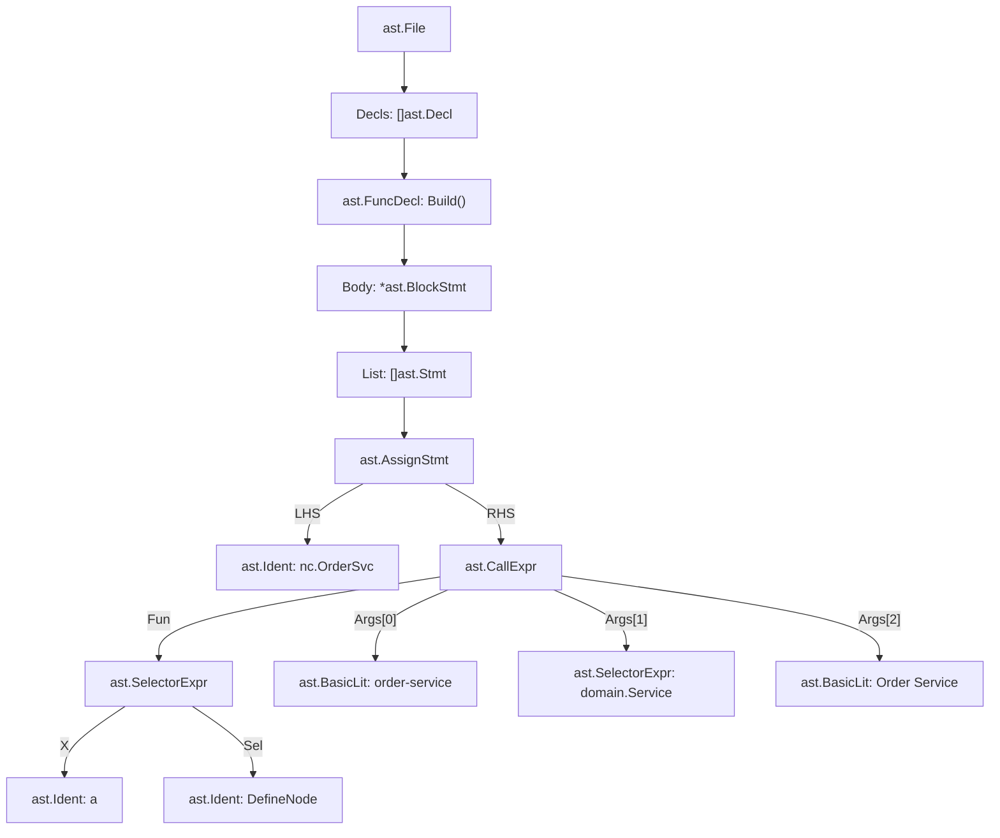
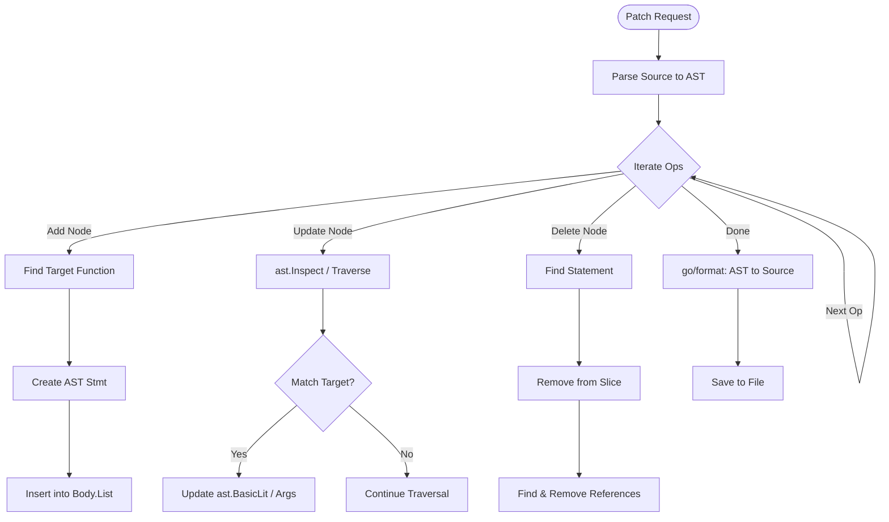

# CALM Studio Architecture Guide (Go DSL & AST Sync)

This document details the architecture for achieving bidirectional synchronization between CALM Studio (React Flow) and the Go DSL (codebase), specifically focusing on **AST (Abstract Syntax Tree)** manipulation and the **Patch** system.

## 1. Overall Architecture Overview

CALM Studio treats the architecture definition written in Go (Go DSL) as the "Source of Truth" while enabling intuitive editing via the GUI. To achieve this, the following bidirectional synchronization flow is implemented.

### Flow 1: Go DSL → GUI (Rendering)
1.  **Build**: `internal/infra/generator` executes the Go DSL (`EcommerceBuilder.Build()`) to construct the `domain.Architecture` model in memory.
2.  **Render**: Converts the model into JSON format and sends it to Studio (Frontend).
3.  **Display**: React Flow interprets the JSON and renders nodes and edges.

### Flow 2: GUI → Go DSL (Patching)
1.  **Action**: User performs an action in the GUI (e.g., rename node, move, delete).
2.  **Patch**: The action details are sent to the backend as a `domain.PatchOperation` struct (JSON).
3.  **AST Sync**: `internal/infra/ast.GoASTSyncer` reads the Go source file and parses it using the **`go/ast`** package.
4.  **Rewrite**: Directly rewrites the AST (Abstract Syntax Tree) based on the patch content.
5.  **Save**: Formats the rewritten AST as Go source code and writes it back to the file.

---

## 2. Patch System Structure

Change requests from the GUI are defined as generic patch operations.

### `domain.PatchOperation`

All change operations are represented by the following structure (`internal/domain/patch.go`).

```go
type PatchOperation struct {
    Type           PatchType    // Operation type (e.g., "update-node", "add-relationship")
    NodeID         string       // CALM ID of the target node
    Origin         *PatchOrigin // Location info in source code (line number, etc.)
    Property       string       // Property name to change (e.g., "name", "description")
    Value          interface{}  // New value
    // ... Other fields depending on operation type (SourceNode, TargetNode, etc.)
}
```

### Main Operation Types (`PatchType`)

| Type | Description | Required Parameters |
| :--- | :--- | :--- |
| `add-node` | Adds a new node definition | `NodeID`, `NodeName`, `NodeTypeName` |
| `update-node` | Modifies properties of an existing node | `NodeID` or `Origin`, `Property`, `Value` |
| `delete-node` | Deletes a node definition | `NodeID` or `Origin` |
| `add-relationship` | Adds `Connect` / `Interacts` | `NodeID`, `SourceNode`, `TargetNode` |
| `update-relationship` | Modifies relationship properties | `NodeID`, `Property`, `Value` |
| `add-control` | Adds `AddControl` | `ControlID`, `ControlDesc` |

---

## 3. AST (Abstract Syntax Tree) Manipulation Details

The `internal/infra/ast` package handles the core AST operations. Instead of regex-based replacement, it parses and manipulates the Go syntax structure, enabling robust rewriting.

### 3.1 Identifying Nodes (`Find`)

To identify a node definition (`a.DefineNode(...)`) in the Go DSL, the following strategies are used:

1.  **Line Number (Priority)**: If `Origin.Line` is provided by the frontend, the `DefineNode` call on that line is identified.
2.  **ID Search (Fallback)**: If no line number is present, the AST is searched for a `DefineNode` call where the first argument (ID string literal) matches `NodeID`.

```go
// internal/infra/ast/patch_impl.go (Conceptual Code)
ast.Inspect(file, func(n ast.Node) bool {
    call, ok := n.(*ast.CallExpr)
    // Find DefineNode function call
    if isDefineNode(call) {
        // Check if argument ID matches
        if matchID(call.Args[0], targetID) {
            found = call
            return false
        }
    }
    return true
})
```

### 3.2 Updating Properties (`Update`)

Rewrites the arguments of the identified `*ast.CallExpr` (function call node).

*   **Basic Arguments**: `Name` (3rd arg) and `Description` (4th arg) are updated by accessing the `call.Args` index and replacing the `*ast.BasicLit`.
*   **Functional Options**: For option arguments like `domain.WithOwner(...)`, the variadic argument part (`call.Args[4:]`) is scanned to find and update the matching function call.

### 3.3 Adding Nodes (`Add`)

When adding a new node, an appropriate insertion point (function) is sought.

1.  **Target Function**: Searches for functions (`*ast.FuncDecl`) where nodes are defined, such as the `Build` method or `defineNodes` function, by name.
2.  **Statement Construction**: Programmatically constructs the AST (`*ast.ExprStmt`) representing the new `DefineNode` call.
3.  **Insertion**: Inserts the new statement at the end of the function's `Body.List` (statement list) or immediately before the `return` statement.

### 3.4 Deletion and Cascading (`Delete`)

Simple line deletion is sometimes insufficient for node deletion.

1.  **Identify Variable Name**: If assigned to a variable like `nc.OrderSvc = a.DefineNode(...)`, that variable name (`nc.OrderSvc`) is identified.
2.  **Delete Definition**: Removes the statement containing `DefineNode` from the AST.
3.  **Delete Dependencies (Cascade)**: Searches for other locations using the identified variable name (`nc.OrderSvc`) (e.g., `nc.OrderSvc.ConnectTo(...)` or `dependencies` metadata) and deletes them in a chain. This prevents "orphan references" that would cause compilation errors.

### 3.5 Visualization of AST Structure and Patching Process (Mermaid)

Visually explains to developers maintaining the AST how the Go DSL maps to the AST and how the patching process works.

#### Correspondence between Go DSL and AST

Shows how the following Go DSL code is represented in the AST.

```go
nc.OrderSvc = a.DefineNode("order-service", domain.Service, "Order Service", "Handles orders")
```


```mermaid
graph TD
    File["ast.File"] --> Decls["Decls: []ast.Decl"]
    Decls --> FuncDecl["ast.FuncDecl: Build()"]
    FuncDecl --> Body["Body: *ast.BlockStmt"]
    Body --> StmtList["List: []ast.Stmt"]
    StmtList --> AssignStmt["ast.AssignStmt"]

    AssignStmt -- LHS --> IdentVar["ast.Ident: nc.OrderSvc"]
    AssignStmt -- RHS --> CallExpr["ast.CallExpr"]

    CallExpr -- Fun --> SelExpr["ast.SelectorExpr"]
    SelExpr -- X --> IdentRecv["ast.Ident: a"]
    SelExpr -- Sel --> IdentMethod["ast.Ident: DefineNode"]

    CallExpr -- Args[0] --> ArgID["ast.BasicLit: order-service"]
    CallExpr -- Args[1] --> ArgType["ast.SelectorExpr: domain.Service"]
    CallExpr -- Args[2] --> ArgName["ast.BasicLit: Order Service"]
```

#### AST Patching Flow (`ApplyPatch`)

The process flow from receiving a patch request to parsing/modifying the AST and saving the file.


```mermaid
flowchart TD
    Start([Patch Request]) --> Parse[Parse Source to AST]
    Parse --> PatchLoop{Iterate Ops}

    PatchLoop -- Add Node --> FindFunc[Find Target Function]
    FindFunc --> CreateStmt[Create AST Stmt]
    CreateStmt --> InsertStmt[Insert into Body.List]

    PatchLoop -- Update Node --> Inspect[ast.Inspect / Traverse]
    Inspect --> Match{Match Target?}
    Match -- Yes --> Modify[Update ast.BasicLit / Args]
    Match -- No --> Continue[Continue Traversal]

    PatchLoop -- Delete Node --> FindStmt[Find Statement]
    FindStmt --> Remove[Remove from Slice]
    Remove --> Cascade[Find & Remove References]

    PatchLoop -- Next Op --> PatchLoop
    PatchLoop -- Done --> Format[go/format: AST to Source]
    Format --> Save[Save to File]
```

### 3.6 Practical Examples of Go DSL to AST Conversion

### Example 1: Node Definition (`Node`)

Explains how a simple CALM model code is actually recognized as a combination of AST nodes. This guides developers on which types (`*ast.Xxx`) to manipulate when implementing a patcher.

**Target Go Code:**
```go
// Simple service definition
srv := a.DefineNode("my-service", domain.Service, "My Service", "A simple service")
```

**Interpretation in AST:**

This single line of code is parsed as an `*ast.AssignStmt` (Assignment Statement), and the function call on the right-hand side has a detailed tree structure.

| Code Element | AST Node Type | Description | Example Patch Operation |
| :--- | :--- | :--- | :--- |
| `srv := ...` | `*ast.AssignStmt` | The entire assignment statement. Has `Lhs` (Left Hand Side) and `Rhs`. | Identify variable name (`srv`) to use for dependency deletion. |
| `srv` | `*ast.Ident` | Identifier (variable name). | Rename variable. |
| `a.DefineNode(...)` | `*ast.CallExpr` | Function call expression. Has `Fun` (Function) and `Args` (Arguments). | **Most Important**. Rewrite contents of `Args` to update properties. |
| `a.DefineNode` | `*ast.SelectorExpr` | Format of `X.Sel`. `X`=`a` (Ident), `Sel`=`DefineNode` (Ident). | Check name to distinguish from other calls (e.g., `ConnectTo`). |
| `"my-service"` | `*ast.BasicLit` | Basic literal (string). `Kind=token.STRING`. | Modify `Value` field to change ID. |
| `domain.Service` | `*ast.SelectorExpr` | Package-qualified identifier. | Replace when changing node type. |

**AST Traversal Image:**

When you want to "update the name" in a patch process, the `ast.Inspect` function performs a depth-first search of the tree and visits nodes as follows:

1.  Discover `*ast.AssignStmt`.
2.  Reach `*ast.CallExpr` (`DefineNode`) on the Right Hand Side (`Rhs[0]`).
3.  Confirm function name is "DefineNode".
4.  Check 1st argument (`Args[0]`) `*ast.BasicLit` → If value is `"my-service"`, target confirmed!
5.  Rewrite 3rd argument (`Args[2]`) `*ast.BasicLit` (`"My Service"`) to the new value.

In this way, Go code is treated not just as text, but as a manipulate-able **object tree**.

### Example 2: Relationship and Method Chaining (`Relationship`)

Method chaining (`.Function().Function()`) is represented in the AST as "nested function calls". The last method call becomes the top (outermost) of the AST tree.

**Target Go Code:**
```go
// Connection definition and details
nc.API.ConnectTo(nc.Svc, "Calls Service").Via("client", "api").Is("internal")
```

**Interpretation in AST (Nested Structure):**

This line is an `*ast.ExprStmt` (Expression Statement), but the `*ast.CallExpr` inside has a layered structure like an onion.

| Code Element | AST Node Type | Structural Position | Description |
| :--- | :--- | :--- | :--- |
| `.Is("internal")` | `*ast.CallExpr` | **Outermost** | `Fun.X` points to the `Via(...)` call. |
| `.Via(...)` | `*ast.CallExpr` | **Middle** | Receiver (`X`) of `Is`. `Fun.X` points to `ConnectTo(...)`. |
| `.ConnectTo(...)` | `*ast.CallExpr` | **Innermost** | The root connection definition. `Fun.X` is `nc.API` (Ident/Selector). |

**Patch Search Logic:**
When updating a relationship, search from the outside in, "peeling" the layers:

1.  Check if current node is a property setting method like `Is` or `Via`.
2.  If so, move to its receiver (`call.Fun.X`) and continue search.
3.  When `ConnectTo` (or `Interacts`) is reached, check/update ID or target node.

### Example 3: Interface Definition (`Interface`)

Interface definitions also use method chaining, but care is needed with numeric literals.

**Target Go Code:**
```go
// Interface definition
srv.Interface("http", "REST").SetPort(8080)
```

**Interpretation in AST:**

| Code Element | AST Node Type | Description | Example Patch Operation |
| :--- | :--- | :--- | :--- |
| `.SetPort(8080)` | `*ast.CallExpr` | Outermost call. | Change port number. |
| `8080` | `*ast.BasicLit` | `Kind=token.INT` (Integer literal). | `Value` is the string "8080", but type must be treated as INT. |
| `.Interface(...)` | `*ast.CallExpr` | Receiver of `SetPort`. | Change ID ("http") or protocol ("REST"). |

**Note:**
In Go AST, integers are also held as string types (`"8080"`) in the `Value` field. When updating the value, you must convert it to a string using `strconv.Itoa(newPort)` etc.

---

## 4. Developer Guide

### Adding a New Patch Operation

1.  **`domain/patch.go`**: Add a new `PatchType` constant and necessary fields to the `PatchOperation` struct.
2.  **`infra/ast/patch_impl.go`**: Add a new case to the switch statement in the `ApplyPatch` method.
3.  **Implement AST Logic**: Implement helper functions (`addXxxToAST`, `updateXxxInAST`) to find specific function calls as needed.
    *   Hint: Existing `addRelationshipToAST` and `updateNodePropertyInAST` serve as good references.

### Debugging AST Operations

If AST operations are not working as intended, check the following:

*   **Function Name/Receiver Name**: Has the DSL code structure changed (e.g., `a.DefineNode` became `arch.DefineNode`)? The current logic attempts to resolve variable names dynamically, but there may be unexpected patterns.
*   **Imports**: When adding a new type (e.g., `domain.NewRequirement`), `go/ast` does not automatically add `import` statements. The current implementation assumes the existing `domain` package is imported when generating `domain.Xxx`.

### Limitations

*   **Complex Logic**: Changes to node definitions inside loops (`for`) or conditionals (`if`) have some limitations (loop variable changes are supported, but parsing complex control flow is not fully supported).
*   **Formatting**: Since `go/format` is used, comment positions may shift unintentionally.

---

> **Note**: This architecture is based on the principle that "Code is the Source of Truth". The GUI acts merely as a code editor, and all changes are ultimately reduced to compilable Go code.
