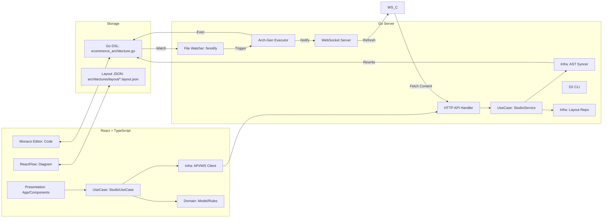
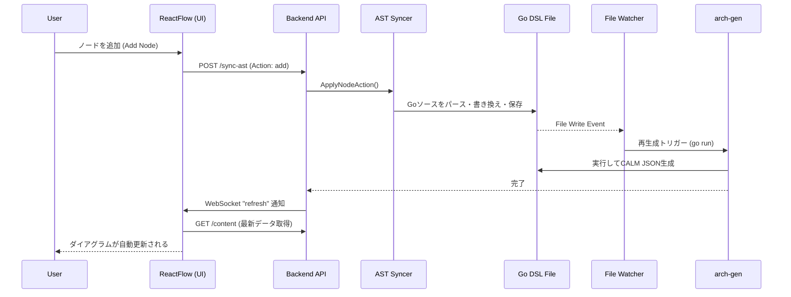

# CALM Studio アーキテクチャ概要

CALM Studioは、FINOS CALM (Common Architecture Language Model) を用いたアーキテクチャ・モデリングを直感的に行うための、双方向同期（Bidirectional Sync）型IDE/ビジュアライザーです。Go DSLを「唯一の真実」として扱い、UI操作はAST同期でGoコードに反映されます。フロントエンドは「ビジネスルール分離」「副作用の集中」「UI薄化」の3原則で構成されています。

## 1. システム構成図

フロントエンド（React/TS）とバックエンド（Go）が密に連携し、Go DSLコードとUI上のダイアグラムを同期させます。

---

## 2. バックエンドアーキテクチャ (Go)

バックエンドは、単なるAPIサーバーではなく、Goコードの解析・操作・実行エンジンとしての役割を担います。

### 主要コンポーネント

- **Server (`cmd/studio/main.go`)**: `gorilla/websocket` と標準 `http` パッケージを用いたAPI/WSサーバー。
- **StudioService (`internal/usecase`)**: レイアウト管理とAST同期のオーケストレーション。
- **AST Syncer (`internal/infra/ast`)**: `go/ast`, `go/parser`, `go/format` を使用し、DSLファイルをソースレベルで直接書き換えます。UIでのノード追加/削除/更新がGoコードに反映されます。
- **Layout Repository (`internal/infra/repository`)**: レイアウト（相対座標 + parentMap）を `architectures/layout/*.layout.json` に保存します。
- **Generator**: `go run ./cmd/arch-gen` をサブプロセスとして実行し、DSLからCALM JSON/D2を生成します。
- **D2 CLI**: D2 DSLをSVGへ変換（`d2 - -`）します。
- **File Watcher**: `fsnotify` で `internal/` などの変更を監視し、手動更新でも自動でダイアグラムを更新します。

### 主要APIエンドポイント

- `GET /content`: 現在のGoコード、CALM JSON、D2 DSL、SVGイメージを返却。
- `POST /sync-ast`: UI操作（ノード追加/削除/更新）をGoコードに反映。
- `GET/POST /layout`: ReactFlowのノード位置情報の永続化。
- `POST /update`: コードエディタからの直接編集をファイルに保存。

### Clean Arch 適合度と例外（Go側）
**結論**: 主要なDomain/UseCase/Infraの分離はできているが、一部は実装・運用の都合でFrameworkに寄せた“例外”が残っています。

- **適合している点**
  - **DomainにPort定義**: `internal/domain/ports.go` に `ASTSyncer` / `LayoutRepository` を定義し、外部詳細を遮断。
  - **UseCaseで手順を集約**: `internal/usecase/studio.go` がレイアウト保存やAST同期をオーケストレーション。
  - **InfraがPortを実装**: `internal/infra/ast`, `internal/infra/repository` が具象実装を担当。

- **例外（規約違反だが現状維持している箇所）**
  - **FrameworkでのI/O/生成処理**: `cmd/studio/main.go` が `go run` / `d2` 実行やファイルI/Oを直接行う。
  - **FrameworkでのDSL更新処理**: `applyD2ChangesToGo` が正規表現でGo DSLを更新するロジックを持つ。

- **なぜ例外にしているか（現実的理由）**
  - Studioは開発支援ツールであり、**実行環境がCLI寄り**で変化が速い。
  - `go run` / `d2` など外部プロセスを呼ぶ処理は、**調整頻度が高く1箇所にまとめた方が運用が楽**。
  - まだUI/同期機能が進化中で、**過度な分割が逆に改修速度を下げる**可能性がある。

**方針**: 将来もここで示した分離レベルを維持し、過度な分割は行わない。  
理由は「ツール開発としての速度・運用性を優先するため」であり、例外箇所は理解した上で最小限に留める。

---

## 3. フロントエンドアーキテクチャ (TypeScript/React)

Vite + React + Tailwind CSSで構築されたモダンなSPA環境です。

### 主要ライブラリ

- **ReactFlow**: ダイアグラムの描画とノード操作。
- **Monaco Editor (`@monaco-editor/react`)**: VS Codeライクなコード編集体験。
- **Dagre**: ダイアグラムの自動レイアウト計算。
- **Lucide React**: UIアイコン。

### Clean Arch 適合度と例外（TypeScript側）
**結論**: 「完全な多層」ではなく、Reactで実用性が高い3原則に統合した構成にしています。境界は明確だが、UI中心の都合で一部は合理的に簡略化しています。

- **適合している点（3原則の統合）**
  1. **ビジネスルールをUIから分離**
     - **実装**: CALMの親子関係算出・比較は `src/domain/` に集約（`buildParentMap`, `parentMapEquals`）。
     - **理由**: UIのライフサイクルに依存しない純粋ロジックとして切り出すことで、再利用・テスト・修正が容易になる。
  2. **副作用を1か所に閉じ込める**
     - **実装**: HTTP/WSは `src/infra/`、呼び出し手順は `src/usecase/` に集約。
     - **理由**: UIから外部I/Oを排除し、通信や同期手順の変更点を一箇所に集約できる。
  3. **UIは薄いアダプタに徹する**
     - **実装**: `App.tsx` は画面状態・イベント配線・描画に限定し、データ取得や更新はUseCaseへ委譲。
     - **理由**: UIは変化が多い領域なので、機能追加・設計変更時の影響範囲を最小化できる。

- **例外（意図的な簡略化）**
  - **厳密なPort/Adapter分離は未採用**: ReactではDI/Portの厳密化よりも開発速度を優先。
  - **UI内に状態統合が残る**: `App.tsx` に状態集約が残るのは、Reactの状態管理特性に合わせた判断。

**方針**: 将来も「3原則」の分離レベルを維持し、厳密な多層化は行わない。  
理由は「Reactの開発速度と運用のバランス」を優先するためで、これ以上の分割は得られる効果よりコストが大きいと判断する。

### 同期メカニズム

1. **Initial Load**: `/content` から全データを取得し、`transformToReactFlow` でCALM JSONをReactFlow形式に変換。
2. **Layout/Grouping**:
   - レイアウトは相対座標として保存し、`parentMap` で親子関係を記録します。
   - `composed-of` の親子関係が変わると、自動的に全体Auto Layoutで再配置します。
3. **Real-time Sync**:
   - バックエンドでファイルが変更されるとWebSocket経由で `refresh` 通知が届き、フロントエンドがデータを再取得。
   - UI上の操作は `usecase` 経由で `sync-ast` を呼び、バックエンドでGoファイルを更新します。
4. **Multi-Tab View**:
   - `Merged`: コードとダイアグラムを左右分割表示（IDEスタイル）。
   - `D2 Diagram`: D2 SVGをフル幅表示し、ズーム/パンで閲覧可能。

---

## 4. 同期シーケンス (UI操作時)

ノードをUI上で追加した際の、フロントエンドとバックエンドの連携フローです。

## 5. 開発者向けTips

- **Go DSLの変更**: `internal/usecase/ecommerce_architecture.go` が同期の対象です。
- **レイアウト保存**: ノードをドラッグすると `architectures/layout/*.layout.json` に相対座標 + `parentMap` が保存されます。
- **親子関係変更**: `composed-of` の親子関係が変わると全体Auto Layoutで再配置されます。
- **自動整形**: バックエンドでのコード書き換え時には `go/format` が適用され、コードの整合性が保たれます。
