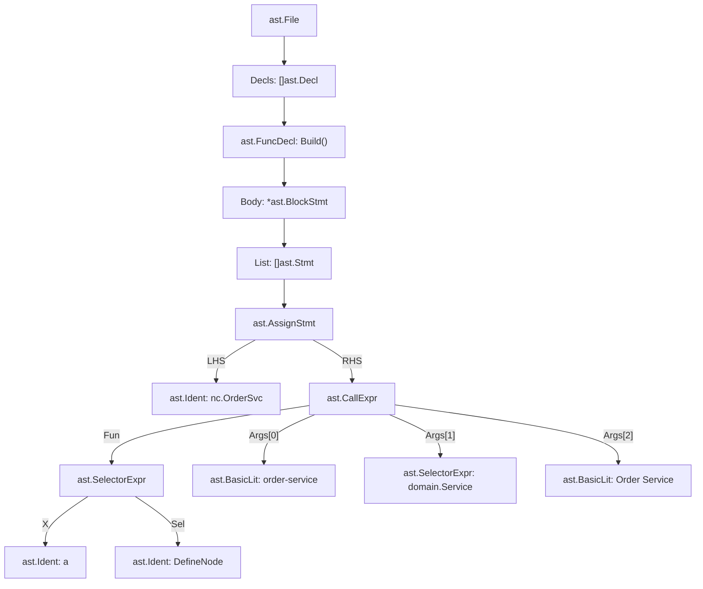
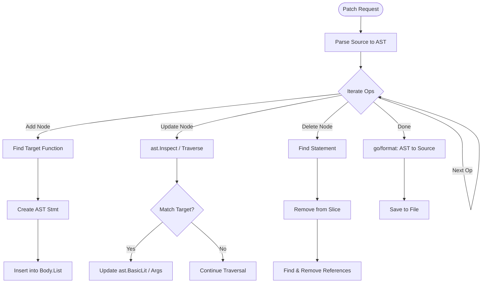

# CALM Studio アーキテクチャガイド (Go DSL & AST Sync)

このドキュメントでは、CALM Studio (React Flow) と Go DSL (コードベース) 間の双方向同期を実現するためのアーキテクチャ、特に **AST (抽象構文木)** の操作と **Patch (パッチ)** システムについて詳述します。

## 1. 全体アーキテクチャ概要

CALM Studio は、Go で記述されたアーキテクチャ定義 (Go DSL) を「正」としつつ、GUI 上での直感的な編集を可能にしています。これを実現するために、以下の双方向同期フローを実装しています。

### フロー 1: Go DSL → GUI (Rendering)
1.  **Build**: `internal/infra/generator` が Go DSL (`EcommerceBuilder.Build()`) を実行し、メモリ上に `domain.Architecture` モデルを構築します。
2.  **Render**: モデルを JSON 形式に変換し、Studio (Frontend) に送信します。
3.  **Display**: React Flow が JSON を解釈し、ノードとエッジを描画します。

### フロー 2: GUI → Go DSL (Patching)
1.  **Action**: ユーザーが GUI で操作（例: ノード名変更、移動、削除）を行います。
2.  **Patch**: 操作内容は `domain.PatchOperation` 構造体（JSON）としてバックエンドに送信されます。
3.  **AST Sync**: `internal/infra/ast.GoASTSyncer` が Go ソースファイルを読み込み、**`go/ast`** パッケージを使って構文解析します。
4.  **Rewrite**: パッチ内容に基づいて AST (抽象構文木) を直接書き換えます。
5.  **Save**: 書き換えられた AST を Go ソースコードとしてフォーマットし、ファイルに書き戻します。

---

## 2. Patch システムの構造

GUI からの変更リクエストは、汎用的なパッチ操作として定義されています。

### `domain.PatchOperation`

すべての変更操作は以下の構造体で表現されます (`internal/domain/patch.go`)。

```go
type PatchOperation struct {
    Type           PatchType    // 操作タイプ (例: "update-node", "add-relationship")
    NodeID         string       // 対象となるノードの CALM ID
    Origin         *PatchOrigin // ソースコード上の位置情報 (行番号など)
    Property       string       // 変更するプロパティ名 (例: "name", "description")
    Value          interface{}  // 新しい値
    // ... その他、操作タイプに応じたフィールド (SourceNode, TargetNode など)
}
```

### 主な操作タイプ (`PatchType`)

| タイプ | 説明 | 必要なパラメータ |
| :--- | :--- | :--- |
| `add-node` | 新しいノード定義を追加 | `NodeID`, `NodeName`, `NodeTypeName` |
| `update-node` | 既存ノードのプロパティ変更 | `NodeID` または `Origin`, `Property`, `Value` |
| `delete-node` | ノード定義の削除 | `NodeID` または `Origin` |
| `add-relationship` | `Connect` / `Interacts` の追加 | `NodeID`, `SourceNode`, `TargetNode` |
| `update-relationship` | 関係のプロパティ変更 | `NodeID`, `Property`, `Value` |
| `add-control` | `AddControl` の追加 | `ControlID`, `ControlDesc` |

---

## 3. AST (抽象構文木) の操作詳細

`internal/infra/ast` パッケージが AST 操作の中核を担います。正規表現による置換ではなく、Go の構文構造を解析して操作するため、堅牢な書き換えが可能です。

### 3.1 ノードの特定 (`Find`)

Go DSL 上でのノード定義 (`a.DefineNode(...)`) を特定するために、以下の戦略を使用します。

1.  **Line Number (優先)**: フロントエンドから `Origin.Line` (行番号) が送られてきた場合、その行にある `DefineNode` 呼び出しを特定します。
2.  **ID Search (フォールバック)**: 行番号がない場合、`DefineNode` の第1引数（ID 文字列リテラル）が `NodeID` と一致する箇所を AST 全体から探索します。

```go
// internal/infra/ast/patch_impl.go (概念コード)
ast.Inspect(file, func(n ast.Node) bool {
    call, ok := n.(*ast.CallExpr)
    // DefineNode 関数呼び出しを探す
    if isDefineNode(call) {
        // 引数のIDが一致するか確認
        if matchID(call.Args[0], targetID) {
            found = call
            return false
        }
    }
    return true
})
```

### 3.2 プロパティの更新 (`Update`)

特定した `*ast.CallExpr` (関数呼び出しノード) の引数を書き換えます。

*   **基本引数**: `Name` (第3引数) や `Description` (第4引数) は、`call.Args` のインデックスにアクセスして `*ast.BasicLit` を差し替えることで更新します。
*   **Functional Options**: `domain.WithOwner(...)` のようなオプション引数は、可変長引数部分 (`call.Args[4:]`) を走査し、該当する関数呼び出しを見つけて引数を更新します。

### 3.3 ノードの追加 (`Add`)

新しいノードを追加する場合、適切な挿入ポイント（関数）を探します。

1.  **ターゲット関数**: `Build` メソッドや `defineNodes` 関数など、ノード定義が行われている関数 (`*ast.FuncDecl`) を名前で検索します。
2.  **ステートメント構築**: 新しい `DefineNode` 呼び出しを表す AST (`*ast.ExprStmt`) をプログラム的に構築します。
3.  **挿入**: 関数の `Body.List` (ステートメントのリスト) の末尾、または `return` 文の直前に新しいステートメントを挿入します。

### 3.4 削除とカスケード処理 (`Delete`)

ノード削除は単純な行削除だけでは不十分な場合があります。

1.  **変数名の特定**: `nc.OrderSvc = a.DefineNode(...)` のように変数に代入されている場合、その変数名 (`nc.OrderSvc`) を特定します。
2.  **定義の削除**: `DefineNode` を含むステートメントを AST から削除します。
3.  **依存関係の削除 (Cascade)**: 特定した変数名 (`nc.OrderSvc`) を使用している他の箇所（例: `nc.OrderSvc.ConnectTo(...)` や `dependencies` メタデータ）を探索し、それらも連鎖的に削除します。これにより、コンパイルエラーになる「孤立した参照」を防ぎます。

### 3.5 AST構造とパッチ処理の可視化 (Mermaid)

AST のメンテナンスを行う開発者向けに、Go DSL がどのように AST にマッピングされ、パッチ処理が行われるかを視覚的に説明します。

#### Go DSL と AST の対応関係

以下の Go DSL コードが AST 内でどのように表現されるかを示します。

```go
nc.OrderSvc = a.DefineNode("order-service", domain.Service, "Order Service", "Handles orders")
```


```mermaid
graph TD
    File["ast.File"] --> Decls["Decls: []ast.Decl"]
    Decls --> FuncDecl["ast.FuncDecl: Build()"]
    FuncDecl --> Body["Body: *ast.BlockStmt"]
    Body --> StmtList["List: []ast.Stmt"]
    StmtList --> AssignStmt["ast.AssignStmt"]

    AssignStmt -- LHS --> IdentVar["ast.Ident: nc.OrderSvc"]
    AssignStmt -- RHS --> CallExpr["ast.CallExpr"]

    CallExpr -- Fun --> SelExpr["ast.SelectorExpr"]
    SelExpr -- X --> IdentRecv["ast.Ident: a"]
    SelExpr -- Sel --> IdentMethod["ast.Ident: DefineNode"]

    CallExpr -- Args[0] --> ArgID["ast.BasicLit: order-service"]
    CallExpr -- Args[1] --> ArgType["ast.SelectorExpr: domain.Service"]
    CallExpr -- Args[2] --> ArgName["ast.BasicLit: Order Service"]
```

#### AST パッチングフロー (`ApplyPatch`)

パッチリクエストを受け取り、AST を解析・変更してファイルを保存するまでのプロセスフローです。


```mermaid
flowchart TD
    Start([Patch Request]) --> Parse[Parse Source to AST]
    Parse --> PatchLoop{Iterate Ops}

    PatchLoop -- Add Node --> FindFunc[Find Target Function]
    FindFunc --> CreateStmt[Create AST Stmt]
    CreateStmt --> InsertStmt[Insert into Body.List]

    PatchLoop -- Update Node --> Inspect[ast.Inspect / Traverse]
    Inspect --> Match{Match Target?}
    Match -- Yes --> Modify[Update ast.BasicLit / Args]
    Match -- No --> Continue[Continue Traversal]

    PatchLoop -- Delete Node --> FindStmt[Find Statement]
    FindStmt --> Remove[Remove from Slice]
    Remove --> Cascade[Find & Remove References]

    PatchLoop -- Next Op --> PatchLoop
    PatchLoop -- Done --> Format[go/format: AST to Source]
    Format --> Save[Save to File]
```

### 3.6 Go DSLからASTへの変換実例

### 実例 1: ノード定義 (`Node`)

単純な CALM モデルのコードが、実際にどのような AST ノードの組み合わせとして認識されるかを解説します。開発者がパッチャーを実装する際、どの型 (`*ast.Xxx`) を操作すべきかの指針になります。

**対象のGoコード:**
```go
// 単純なサービス定義
srv := a.DefineNode("my-service", domain.Service, "My Service", "A simple service")
```

**AST における解釈:**

この 1 行のコードは `*ast.AssignStmt`（代入文）として解析され、右辺の関数呼び出しが詳細なツリー構造を持ちます。

| コード要素 | AST ノード型 | 説明 | パッチ時の操作例 |
| :--- | :--- | :--- | :--- |
| `srv := ...` | `*ast.AssignStmt` | 代入文全体。`Lhs` (左辺) と `Rhs` (右辺) を持つ。 | 変数名 (`srv`) を特定して、依存関係の削除に使用。 |
| `srv` | `*ast.Ident` | 識別子（変数名）。 | 変数名の変更。 |
| `a.DefineNode(...)` | `*ast.CallExpr` | 関数呼び出し式。`Fun` (関数) と `Args` (引数) を持つ。 | **最も重要**。`Args` の内容を書き換えてプロパティを更新。 |
| `a.DefineNode` | `*ast.SelectorExpr` | `X.Sel` の形式。`X`=`a` (Ident), `Sel`=`DefineNode` (Ident)。 | `DefineNode` 以外の呼び出し（例: `ConnectTo`）と区別するために名前を確認。 |
| `"my-service"` | `*ast.BasicLit` | 基本リテラル（文字列）。`Kind=token.STRING`。 | `Value` フィールドを書き換えて ID を変更。 |
| `domain.Service` | `*ast.SelectorExpr` | パッケージ修飾された識別子。 | ノードタイプの変更時に差し替え。 |

**AST トラバーサルのイメージ:**

パッチ処理で「名前を更新したい」場合、`ast.Inspect` 関数はツリーを深さ優先探索し、以下のようにノードを訪問します。

1.  `*ast.AssignStmt` を発見。
2.  右辺 (`Rhs[0]`) の `*ast.CallExpr` (`DefineNode`) に到達。
3.  関数名が "DefineNode" であることを確認。
4.  第1引数 (`Args[0]`) の `*ast.BasicLit` をチェック → 値が `"my-service"` ならターゲット確定！
5.  第3引数 (`Args[2]`) の `*ast.BasicLit` (`"My Service"`) を新しい値に書き換える。

このように、Go のコードは単なるテキストではなく、操作可能な**オブジェクトのツリー**として扱われます。

### 実例 2: リレーションシップとメソッドチェーン (`Relationship`)

メソッドチェーン（`.Function().Function()`）は、AST では「関数呼び出しの入れ子」として表現されます。最も後ろのメソッド呼び出しが、AST ツリーの頂点（一番外側）になります。

**対象のGoコード:**
```go
// 接続定義と詳細設定
nc.API.ConnectTo(nc.Svc, "Calls Service").Via("client", "api").Is("internal")
```

**AST における解釈 (入れ子構造):**

この行は `*ast.ExprStmt`（式文）ですが、その中身の `*ast.CallExpr` は玉ねぎのような層構造になっています。

| コード要素 | AST ノード型 | 構造上の位置 | 説明 |
| :--- | :--- | :--- | :--- |
| `.Is("internal")` | `*ast.CallExpr` | **最上位 (Outer)** | `Fun.X` が `Via(...)` の呼び出しを指す。 |
| `.Via(...)` | `*ast.CallExpr` | **中間 (Middle)** | `Is` のレシーバ (`X`)。`Fun.X` が `ConnectTo(...)` を指す。 |
| `.ConnectTo(...)` | `*ast.CallExpr` | **最深部 (Inner)** | ルートとなる接続定義。`Fun.X` は `nc.API` (Ident/Selector)。 |

**パッチ時の探索ロジック:**
リレーションシップを更新する場合、以下のように外側から内側へ「皮をむく」ように探索します。

1.  現在のノードが `Is` や `Via` などのプロパティ設定メソッドか確認。
2.  そうであれば、そのレシーバ (`call.Fun.X`) に移動して探索を継続。
3.  `ConnectTo`（または `Interacts`）に到達したら、ID や接続先ノードを確認・更新。

### 実例 3: インターフェース定義 (`Interface`)

インターフェースも同様にメソッドチェーンですが、数値リテラルの扱いに注意が必要です。

**対象のGoコード:**
```go
// インターフェース定義
srv.Interface("http", "REST").SetPort(8080)
```

**AST における解釈:**

| コード要素 | AST ノード型 | 説明 | パッチ時の操作例 |
| :--- | :--- | :--- | :--- |
| `.SetPort(8080)` | `*ast.CallExpr` | 最上位の呼び出し。 | ポート番号の変更。 |
| `8080` | `*ast.BasicLit` | `Kind=token.INT` (整数リテラル)。 | `Value` は文字列 "8080" だが、型は INT として扱う必要がある。 |
| `.Interface(...)` | `*ast.CallExpr` | `SetPort` のレシーバ。 | ID ("http") やプロトコル ("REST") の変更。 |

**注意点:**
Go の AST では、整数も `Value` フィールドは文字列型（`"8080"`）で保持されます。値を更新する際は `strconv.Itoa(newPort)` などで文字列化してセットする必要があります。

---

## 4. 開発者向けガイド

### 新しい Patch 操作を追加する場合

1.  **`domain/patch.go`**: 新しい `PatchType` 定数と、必要なフィールドを `PatchOperation` 構造体に追加します。
2.  **`infra/ast/patch_impl.go`**: `ApplyPatch` メソッド内の switch 文に新しいケースを追加します。
3.  **AST ロジックの実装**: 必要に応じて、特定の関数呼び出しを探すヘルパー関数 (`addXxxToAST`, `updateXxxInAST`) を実装します。
    *   ヒント: 既存の `addRelationshipToAST` や `updateNodePropertyInAST` が参考になります。

### AST 操作のデバッグ

AST 操作が意図通り動かない場合、以下の点を確認してください。

*   **関数名/レシーバ名**: DSL コードの構造が変わっていないか（例: `a.DefineNode` が `arch.DefineNode` になっている等）。現在のロジックは変数名を動的に解決しようとしますが、想定外のパターンがあるかもしれません。
*   **インポート**: 新しい型（例: `domain.NewRequirement`）を追加する場合、`go/ast` は自動で `import` 文を追加しません。現状の実装では既存の `domain` パッケージがインポートされている前提で `domain.Xxx` を生成しています。

### 制限事項

*   **複雑なロジック**: ループ (`for`) や条件分岐 (`if`) の内部にあるノード定義の変更は、一部制限があります（ループ変数の変更などは対応していますが、複雑な制御フローの解析は完全ではありません）。
*   **フォーマット**: `go/format` を使用しているため、コメントの位置などが意図せず移動する場合があります。

---

> **Note**: このアーキテクチャは「コードが真実の源 (Source of Truth)」であるという原則に基づいています。GUI はあくまでコードのエディタとしての役割を果たし、すべての変更は最終的にコンパイル可能な Go コードに還元されます。
